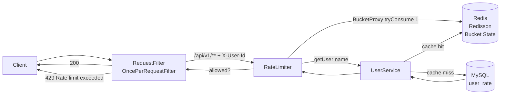

# API Rate Limiter

A Spring Boot service implementing per-user API rate limiting using the token bucket algorithm (Bucket4j), backed by Redis (Redisson) for distributed bucket state, with user-specific limits stored in MySQL.

## Tech Stack
- **Spring Boot 3.4.4** (Java 21) — `spring-boot-starter-parent:3.4.4` in `pom.xml:8`
- **MySQL 8** — stores per-user rate limit configuration (`user_rate` table)
- **Redis + Redisson 3.27.2** — distributed cache and bucket state storage
- **Bucket4j 8.9.0** — token bucket algorithm (`bucket4j-core` + `bucket4j-redis`)

> Java 21 is the correct baseline for Boot 3.4.x.

## Architecture

```
Client --X-User-Id--> RequestFilter (/api/v1/**) --tryConsume()--> RateLimiter (Bucket4j) --> Redis (Redisson ProxyManager)
                          |  429 if bucket empty                     ^      |
                          |  200 + consume 1 token if allowed         |      v
                          |                                    getUser(name)
                          |                                          |
                                                                UserService --cache miss--> MySQL (user_rate)
                                                                    |
                                                                 RMapCache "userList" (TTL 60s)
```

Mermaid:



Sequence: see `sequence-diagram.png` in repo root.

Flow:
1. Each user has a `request_limit` defined in `user_rate` table in MySQL.
2. `UserService.java:21` caches user lookups in Redis `RMapCache("userList")` with 60s TTL to avoid DB hit on every request.
3. Requests to any `/api/v1/**` endpoint must include `X-User-Id` header. `RequestFilter.java:28` intercepts them.
4. `RateLimiter.java:22` checks the caller's token bucket stored in Redis via `ProxyManager`. If tokens available, consumes 1 and proceeds (`200`). If empty, returns `429 Too Many Requests` (`RequestFilter.java:39`).
5. `RedisConfig.java:26` configures `RedissonBasedProxyManager` with `ExpirationAfterWriteStrategy` 10 min for bucket keys.
6. `/api/v2/**` endpoints are intentionally **not** rate-limited — useful for comparing protected vs unprotected behavior.

## Bucket Refill Logic

Per-user bucket is built in `RateLimiter.java:31-33`:

```java
Bandwidth limit = Bandwidth.classic(
    user.getLimit(),                                    // e.g. 5 for user1
    Refill.intervally(user.getLimit(), Duration.ofMinutes(1))
);
```

- **Classic token bucket** with `maxTokens = user.getLimit()`.
- **Refill strategy: `intervally`** — refills **full limit every 1 minute**. Not greedy/smooth, but all-or-nothing at minute boundary.
- Example: `user1` with `limit=5` gets 5 tokens at `t=0`, 0 remaining after 5 requests, then 5 tokens again at `t=60s`. No partial refill within the window.
- Bucket state is distributed in Redis, so multiple app instances share the same counter. Expiry 10 min after last write (`RedisConfig.java:29`) prevents stale keys.

## Project Structure
```
com.ratelimit
├── Config        → Redis/Redisson and Bucket4j proxy manager configuration
├── Controller    → REST endpoints
├── Filter        → Rate limiting enforcement filter
├── Model         → JPA entities
├── Repository    → Spring Data JPA repositories
└── Service       → Business logic (user lookup, rate limiting)
```
```
src/main/resources/
  application.properties
  create-table.sql / schema.sql
```

## Setup

### 1. MySQL

Create the database:

```sql
CREATE DATABASE rate_limit_db;
```

Schema is in `src/main/resources/create-table.sql` (also `schema.sql`). Auto-created if `spring.jpa.hibernate.ddl-auto=update`.

```sql
CREATE TABLE `user_rate` (
    `id` INT NOT NULL AUTO_INCREMENT,
    `name` VARCHAR(50) NOT NULL,
    `request_limit` INT NOT NULL,
    PRIMARY KEY (`id`),
    UNIQUE KEY `uk_name` (`name`)
) ENGINE=InnoDB DEFAULT CHARSET=utf8mb4;
```

### 2. Redis
Run Redis locally via Docker:

```bash
docker run -d -p 6379:6379 redis
```

### 3. Configure `application.properties`

Full block from `src/main/resources/application.properties`:

```properties
spring.application.name=rate-limit
server.port=9090

# MySQL - per-user rate limit config (table: user_rate)
spring.datasource.url=jdbc:mysql://localhost:3306/rate_limit_db
spring.datasource.username=root
spring.datasource.password=rapid
spring.datasource.driver-class-name=com.mysql.cj.jdbc.Driver
spring.jpa.hibernate.ddl-auto=update
spring.jpa.show-sql=true

# Redis - distributed bucket state (Redisson) + user cache
# NOTE: for Spring Boot 3.4.x the correct prefix is spring.data.redis.* (spring.redis.* was removed in Boot 3)
spring.data.redis.host=localhost
spring.data.redis.port=6379
# Redisson also reads redis://localhost:6379 directly in RedisConfig.java

# User lookup cache TTL (used as RMapCache TTL in UserService = 60s)
caching.spring.userListTTL=60000
```

> **Migration note Boot 3.x:** `spring.redis.host/port` (Boot 2.x) → `spring.data.redis.host/port` (Boot 3.x). This project uses the new `spring.data.redis.*` keys plus hardcoded `redis://localhost:6379` in `RedisConfig.java:21` for Redisson. The legacy `spring.redis.*` will fail to bind on Boot 3.4.

### 4. Run the application

```bash
./mvnw spring-boot:run
# or: mvn spring-boot:run
# app on http://localhost:9090
```

### 5. Add test users

```sql
INSERT INTO user_rate (name, request_limit) VALUES ('user1', 5) ON DUPLICATE KEY UPDATE request_limit=VALUES(request_limit);
INSERT INTO user_rate (name, request_limit) VALUES ('user2', 10) ON DUPLICATE KEY UPDATE request_limit=VALUES(request_limit);
INSERT INTO user_rate (name, request_limit) VALUES ('premium1', 100) ON DUPLICATE KEY UPDATE request_limit=VALUES(request_limit);
-- or: mysql -u root -p rate_limit_db < src/main/resources/create-table.sql
```

## Usage

**Endpoint:**
```
GET :  /api/v1/user
Header:  X-User-Id : user1
```

**Behavior:**

| Scenario | Response |
|---|---|
| Valid header + tokens available | `200 OK` |
| Valid header + no tokens left | `429 Too Many Requests` |
| Missing header | `403 Forbidden` |

## Demonstrable Proof — 429 on 6th request (limit 5)

`user1` has `request_limit=5` per minute. The 6th request in same window must return `429`.

### curl (copy-paste)

```bash
# 5 allowed -> 200, 6th -> 429
for i in 1 2 3 4 5 6; do
  echo -n "Request $i: "
  curl -s -o /tmp/body -w "%{http_code}" -H "X-User-Id: user1" http://localhost:9090/api/v1/user
  echo " $(cat /tmp/body)"
done
```

**Expected output:**

```
Request 1: 200 Hello Secure User
Request 2: 200 Hello Secure User
Request 3: 200 Hello Secure User
Request 4: 200 Hello Secure User
Request 5: 200 Hello Secure User
Request 6: 429 Rate limit exceeded for: user1
```

Missing header case: `curl -i http://localhost:9090/api/v1/user` → `403 Missing X-User-Id header` (`RequestFilter.java:32`).
Unlimited endpoint: `curl -H "X-User-Id: user1" http://localhost:9090/api/v2/user` → always `200` (not under `/api/v1`).

Wait 60s after limit hit and the bucket refills to 5 — next request succeeds (`Refill.intervally`).

### JMeter

1. Thread Group: 6 threads, ramp-up 1s, loop 1.
2. HTTP Request: `GET http://localhost:9090/api/v1/user`, Header `X-User-Id: user1`.
3. View Results Tree / Aggregate Report: expect 5× `200`, 1× `429`.
4. Screenshot the Aggregate Report showing `Samples 6, Errors 1 (16.67%)` and the `429` response body in View Results Tree for sample 6. Save as `jmeter-429-proof.png` and keep in repo root.

> Tip for screen recording: run the curl loop above in one shot — interviewers prefer a single terminal capture over manual clicks.

## Endpoints
- `GET /api/v1/user` — rate limited, requires `X-User-Id`
- `GET /api/v2/user` — not rate limited (no filter match, see `UserController.java:14`)
